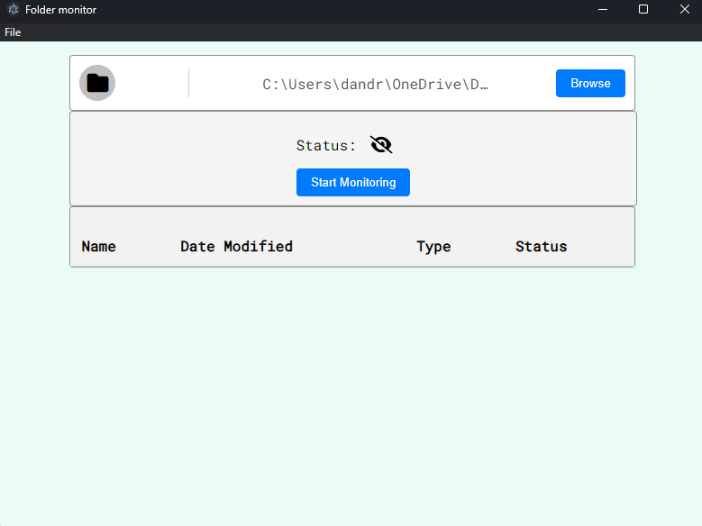
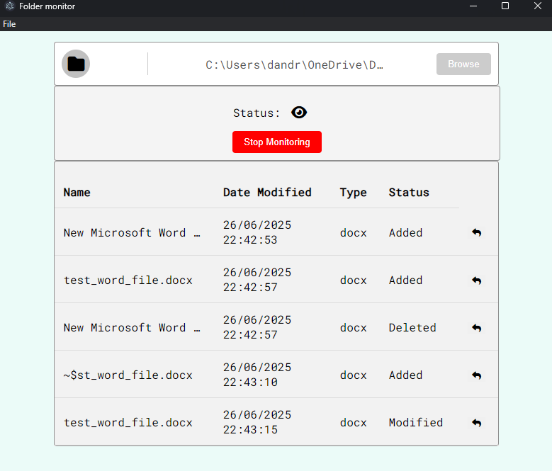
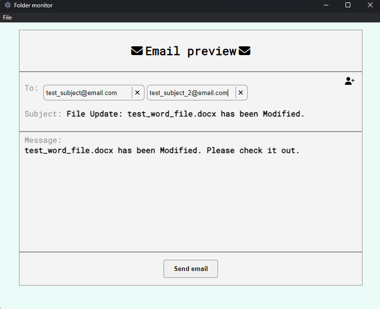

## 📁 Project Overview

This is a **frontend-only Electron desktop application** that monitors a selected folder for file changes and lets users
preview and send email notifications about those changes.

---

## ⚠️ Critical Notes

### 🔧 Settings & API Integration — *Unfinished*

This project **originally intended** to:

* Allow employees to enter an **API key** for a custom internal server
* Automatically **upload modified files** to that server
* Send an email notification when a file is changed

However:

❌ The backend API was **never provided so it was never implemented**

❌ File uploading functionality is **non-functional**

✅ **Only local file tracking and email sending work**

---

### ❋ No Backend Included

> ❗ **This application does not include any backend or email service.**

To send emails, the user must:

* Provide their **own backend server**
* Ensure it exposes a compatible endpoint like:

  ```
  POST http://127.0.0.1:8000/api/send_email/
  ```

📌 The app uses a `fetch()` POST request to send emails, but:

* The actual server must be **self-hosted**
* **Email credentials and routing** are handled entirely by the user’s backend

---

## ✅ Current Working Features

* 🔎 Monitor a selected folder for:

    * File additions
    * Modifications
    * Deletions
* 📊 Display the last 5 changes in a table
* 📤 Preview and send an email notification for each change

---

## 💪 Technology Stack

* ⚡ **Electron** for desktop app container
* 🌐 **HTML + CSS + JS** for frontend logic
* 🎨 **Font Awesome** for icons

---

## 🖼️ User Interface Overview

### 📌 Base Interface – `base.png`



- **Browse button** allows users to select a folder for monitoring.
- **Start Monitoring**: starts watching the folder for file changes.
- Monitoring can be stopped at any time.
- Below that, a table section appears with columns:
    - **Name** – file name
    - **Date Modified** – date & time of change
    - **Type** – file type
    - **Status** – added, modified, or deleted

---

### 📡 Active Monitoring – `monitoring.png`



- Shows files that have triggered changes.
- Each row has an **email preview icon** (reply arrow).
- Clicking the icon opens the **email preview window**.

---

### ✉️ Email Preview – `sending.png`



- **TO:** input allows selecting one or more recipients.
- **Subject** is pre-filled based on `config.json`, but can be edited freely.
- **Message** area is also pre-filled from `config.json` and editable.
- At the bottom, a **Send Email** button dispatches the email using the user-supplied backend server.

